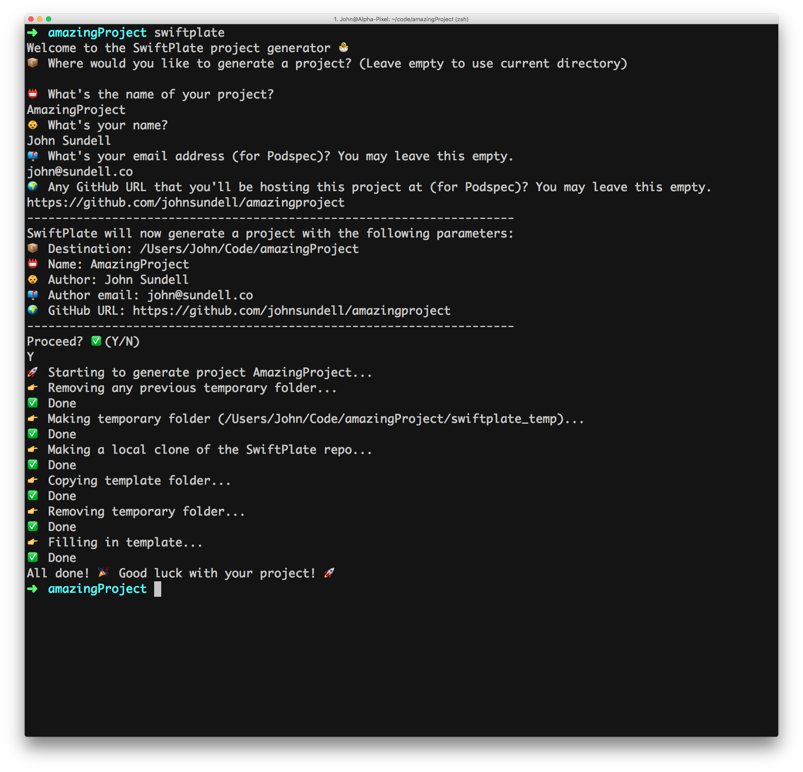

# SwiftPlate

Easily generate cross platform Swift framework projects from the command line.

SwiftPlate will generate Xcode projects for you in seconds, that support:

- [x] CocoaPods
- [x] Carthage
- [x] Swift Package Manager
- [x] iOS
- [x] macOS
- [x] watchOS
- [x] tvOS
- [x] Linux
- [x] Quick + Nimble testing

Just run `swiftplate`, and you’ll be presented with a simple step-by-step guide:



## Usage

### Using [Homebrew](https://brew.sh) (recommended)

```
$ brew install swiftplate
$ swiftplate
```

### Using Make

```
$ git clone git@github.com:JohnSundell/SwiftPlate.git
$ cd swiftplate
$ make
```

### Using [Marathon](https://github.com/johnsundell/marathon)

```
$ git clone git@github.com:JohnSundell/SwiftPlate.git
$ marathon run swiftplate/main
```

### Using the Swift interpreter directly

```
$ git clone git@github.com:JohnSundell/SwiftPlate.git
$ swift swiftplate/main.swift
```

### Using Xcode

```
$ git clone git@github.com:JohnSundell/SwiftPlate.git
$ open swiftplate/SwiftPlate.xcodeproj
```

## Command line arguments

Besides using the guide to input information, SwiftPlate also supports command line arguments when launched. When a certain piece of information is supplied through an argument, SwiftPlate won't ask for that information when run. These are the arguments currently supported:


| Name | Description | Long parameter | Short parameter |
| ---- | ----------- | -------------- | --------------- |
| Destination | Where the generated project should be saved | `--destination` | `-d` |
| Project name | The name of your project | `--project` | `-p` |
| Author name | Your name | `--name` | `-n` |
| Author email | Your email (for Podspec) | `--email` | `-e` |
| GitHub URL | Any URL you'll be hosting the project at (for Podspec) | `--url` | `-u` |
| Organization name | The name of your organization | `--organization` | `-o` |
| Repo | Any custom SwiftPlate repository that should be used for templates | `--repo` | `-r` |
| Force | Prevent user prompt at the end (for CIs etc.) | `--force` | `-f` |

## Questions or feedback?

Feel free to [open an issue](https://github.com/JohnSundell/SwiftPlate/issues/new), or find me [@johnsundell on Twitter](https://twitter.com/johnsundell).
